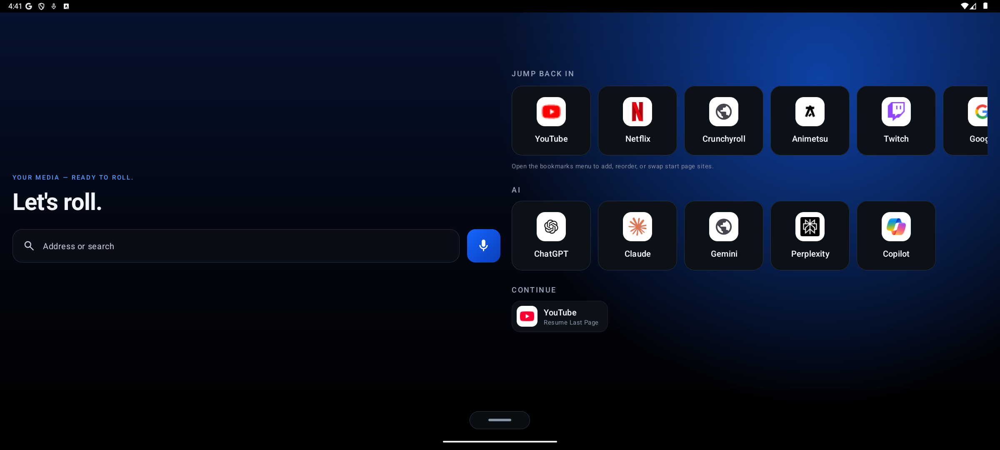
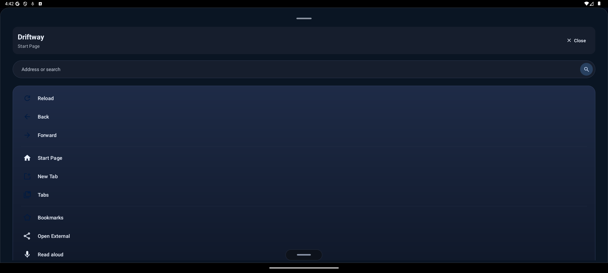
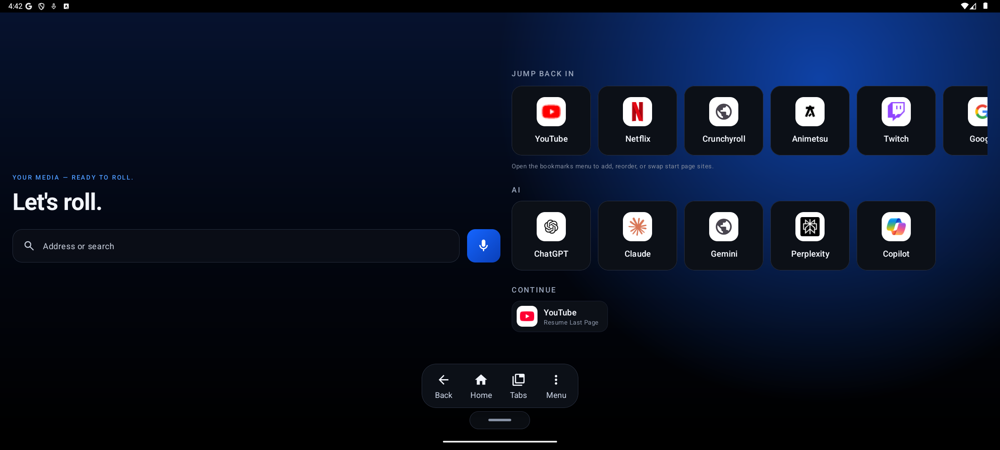
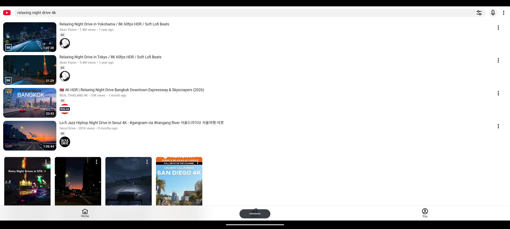
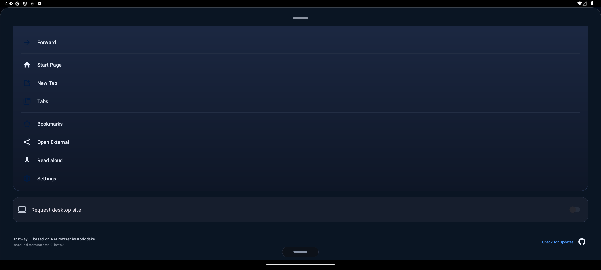

# Driftway

**A premium, car‑native browser for parked head units.**
Driftway turns a parked car's screen into a cinematic media hub — YouTube, Netflix, Crunchyroll, your AI assistants — with a true‑black AMOLED interface built for glancing, not squinting.

  

> [!WARNING]
> **For parked use.** Driftway is designed for when the car is stationary or for passengers. Video playback requires explicit passenger confirmation. **If you are driving, keep your eyes on the road** — use audio and voice only.

---

## ✨ Features

- 🎬 **Cinematic Media Hub home** — a landscape, left/right layout with an **Entertainment** shelf (YouTube · Netflix · Crunchyroll · Animetsu · Twitch) and an **AI** shelf (ChatGPT · Claude · Gemini · Perplexity · Copilot), real site logos, and a "Continue" row.
- 🎛️ **Swipe‑up control bar** — a fixed, always‑visible handle reveals **Back · Home · Tabs · Menu**. No hunting for a floating button.
- 🌌 **AMOLED‑dark design** — one electric‑blue accent on true black, a soft squircle shape language, and a glanceable type scale. Smooth, lightweight motion that stays fluid on any head unit.
- 🛡️ **Ad, tracker & pop‑up blocking** — blocks ad/tracker requests, hides leftover ad slots, and stops pop‑up / pop‑under / dialog spam on sketchy sites. *(YouTube's own video ads can't be reliably blocked — see Limitations.)* Includes optional **SponsorBlock** for YouTube.
- 🔊 **Background audio** — audio keeps playing when the app is backgrounded or the screen is off, with full media‑notification controls.
- 🔒 **Passenger video consent gate** — video only starts after a passenger/non‑driver confirms; muted previews never interrupt browsing.
- 🗣️ **Read‑Aloud (TTS)** — have the current page's text read to you. Listen to articles while driving.
- 🎙️ **Voice search** — tap the mic and speak a search or a URL.
- 🗂️ **Tabs, bookmarks & more** — real multi‑tab browsing with a tab manager, dashboard bookmarks, QR share, smart desktop mode, and a global display‑scale control.

---

## 📸 Screenshots

> Captured on a landscape head‑unit display — the layout Driftway is built for.

<table>
  <tr>
    <td width="50%" valign="top">
      
       <b>Sleek menu</b> — every control one tap away, no browser clutter.
    </td>
    <td width="50%" valign="top">
      
       <b>Swipe‑up control bar</b> — Back · Home · Tabs · Menu, always within reach.
    </td>
  </tr>
  <tr>
    <td width="50%" valign="top">
      
       <b>The real web</b> — full sites and real video, not a stripped‑down shell.
    </td>
    <td width="50%" valign="top">
      
       <b>Settings</b> — legible AMOLED‑dark preferences and built‑in updates.
    </td>
  </tr>
</table>

---

## 📦 Install

> **Requires Android 15+.** Sideload only.

1. Download the latest **`Driftway-x.y.apk`** from **[GitHub Releases](https://github.com/CreatorGhost/Driftway/releases/latest)**.
2. Install it. To **update**, install the new APK *over* the existing one (don't uninstall) so your logins and data are kept.

<b>Enabling sideloaded apps on Android Auto</b>

1. Open your phone's **Android Auto** settings.
2. Tap the **Version** entry **10 times** to unlock Developer settings.
3. Open the **⋮ menu → Developer settings**.
4. Enable **Unknown sources**.

---

## ⚠️ Limitations (honest)

- 📺 **Video in motion is blocked by the platform** — this is an Android Auto / AAOS rule, not a Driftway choice. Driftway is for parked use.
- 🔐 **Widevine L3 only** — DRM video (Netflix etc.) is limited to standard definition by the head unit's DRM level.
- 🚫 **YouTube video ads aren't blocked** — they're served inside the video stream and can't be reliably removed in a WebView. General web ads, trackers, and pop‑ups *are* blocked.
- 🚘 **Host behavior varies** — exact projection behavior differs by car/OEM and region.

---

## 🔒 Privacy

- **No analytics, no trackers.** Driftway does not collect usage data or phone home.
- **No URL/keystroke tracking** — your browsing stays on your device.

---

## 🙏 Credits

Driftway is a complete redesign built on **[AABrowser](https://github.com/kododake/AABrowser) by Kododake**, the original Android‑Auto WebView browser. Huge thanks to Kododake and the original contributors — Driftway exists because of that groundwork. Licensed under **GPLv3**; original copyright and attribution are preserved.

## 🤝 Contributing

Bug reports, ideas, and PRs are welcome — open an issue or a pull request.

## 📄 License

Released under the **[GNU General Public License v3.0](https://www.gnu.org/licenses/gpl-3.0)**. If you reuse this code, you must keep it open‑source under GPLv3 and preserve attribution.

---

**Stay parked, keep your eyes on the road, and enjoy the ride. 🚗💙**
